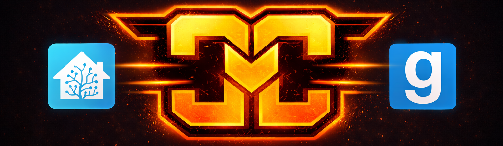

# 🎮 Garry's Mod Dedicated Server
## Home Assistant Add-on

Dieses Add-on installiert und betreibt einen **Garry's Mod Dedicated Server** direkt in Home Assistant über SteamCMD.

Der Server kann vollständig über die Add-on-Konfiguration verwaltet werden und speichert alle Daten persistent im Home Assistant `/share` Ordner.

---

## ✅ Features

- Automatische Installation über SteamCMD
- Automatische Updates beim Start (optional)
- Persistente Serverdaten
- Automatische oder manuelle server.cfg Verwaltung
- Crash-Erkennung mit automatischem Restart
- Workshop Collection Support
- Konfigurierbare Serverparameter
- Home Assistant kompatibles Logging

---

## 📁 Serverdaten

Alle Serverdaten bleiben bei Updates erhalten:

```
/share/gmod/server/
└── garrysmod/
    ├── addons
    ├── cfg
    ├── data
    ├── logs
    └── workshop
```

Die Serverkonfiguration liegt unter:

```
/share/gmod/server/garrysmod/cfg/server.cfg
```

---

## ⚙️ server.cfg automatisch erzeugen

Option im Add-on:

```
generate_server_cfg_on_start
```

| Wert | Verhalten |
|------|-----------|
| true | server.cfg wird bei jedem Start neu erstellt |
| false | Datei bleibt unverändert und kann manuell bearbeitet werden |

---

## 🔁 Automatischer Neustart bei Crash

Der Server wird bei Absturz automatisch neu gestartet.

Konfigurierbar über:

```
auto_restart_on_crash
restart_delay_seconds
```

---

## 🌐 Standard Ports

| Port | Zweck |
|------|------|
| UDP 27015 | Game / Query |
| UDP 27005 | Client |
| TCP 27016 | RCON |

Ports können bei Bedarf angepasst werden.

---

## 📦 Workshop Support

Folgende Optionen stehen zur Verfügung:

- `workshop_collection_id`
- `workshop_authkey`

Damit können Addons automatisch geladen werden.

---

## 🚀 Installation

1. Add-on in Home Assistant installieren
2. Konfiguration anpassen
3. Server starten

Beim ersten Start lädt SteamCMD den Server vollständig herunter.

---

## 🛠️ Hinweise

- Der erste Start kann mehrere Minuten dauern.
- Große Workshop Collections verlängern die Startzeit.
- Serverdaten bleiben bei Updates erhalten.

---

## 📦 Teil der Game Server Add-on Sammlung

Dieses Add-on gehört zur Home Assistant Gameserver Add-on Reihe.

Weitere Verbesserungen geplant:
- Spieleranzahl Sensor
- Serverstatus Sensor
- Restart Button in Home Assistant
- Backup Funktionen

---

Viel Spaß mit deinem Garry's Mod Server! 🎉
